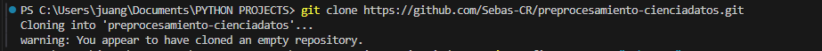
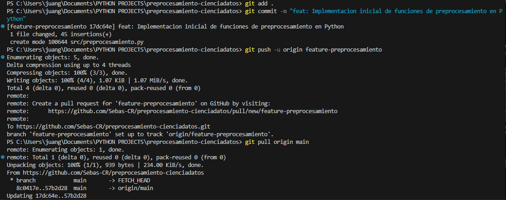
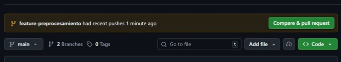
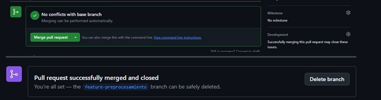
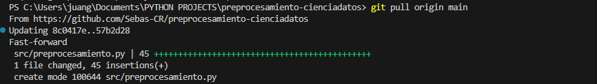
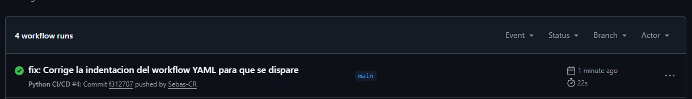

# Documentación del Proyecto: Flujo Git para Preprocesamiento de Datos

El proyecto `preprocesamiento-cienciadatos` se creó para establecer y demostrar un **flujo de trabajo de control de versiones completo** (simulando un Git Flow simplificado), utilizando Git y GitHub. La funcionalidad implementada es el **módulo Python de preprocesamiento de datos** (`src/preprocesamiento.py`), que incluye funciones de limpieza y normalización.

## Comandos Git y Flujo de Trabajo Implementado

A continuación, se listan todos los comandos y acciones ejecutadas, siguiendo el orden del flujo de trabajo:

### FASE 1: Inicialización y Configuración

| Paso | Comando/Acción | Propósito |
| :--- | :--- | :--- |
| **1. Clonación** | `git clone <url>` | Descargó el repositorio vacío de GitHub a la máquina local. |
| **2. Configuración** | `cd preprocesamiento-cienciadatos` | Navegó al directorio del proyecto. |
| **3. Configuración** | `git config user.name "..."` | Configuró la identidad del autor para los commits. |
| **4. Archivos Base** | `touch .gitignore` y `touch README.md` | Creación de los archivos de configuración y documentación inicial. |
| **5. Staging** | `git add .gitignore README.md` | Preparó los archivos iniciales para el seguimiento de versiones. |
| **6. Commit Inicial** | `git commit -m "Commit inicial: configuracion de .gitignore y README.md"` | Creó la primera instantánea del proyecto. |
| **7. Push Inicial** | `git push origin main` | Subió el commit inicial a la rama principal de GitHub. |

---

### FASE 2: Desarrollo, Pull Request y Fusión

| Paso | Comando/Acción | Propósito |
| :--- | :--- | :--- |
| **8. Creación de Rama** | `git checkout -b feature-preprocesamiento` | Creó la rama local para el desarrollo de la característica. |
| **9. Desarrollo** | Creación de `src/preprocesamiento.py` | Implementación de las funciones de preprocesamiento en la nueva rama. |
| **10. Staging** | `git add .` | Agregó la nueva carpeta `src/` y su contenido al área de preparación. |
| **11. Commit** | `git commit -m "feat: Implementacion inicial de funciones de preprocesamiento en Python"` | Confirmó el código de la nueva característica. |
| **12. Push de Rama** | `git push -u origin feature-preprocesamiento` | Subió la rama y su contenido a GitHub. |
| **13. Pull Request (Web)** | Creación y Fusión de la PR | Solicitó y aceptó la fusión de la rama `feature-preprocesamiento` a `main`, simulando la revisión de código. |
| **14. Eliminación Remota (Web)** | Clic en **"Delete branch"** | Eliminó la rama en el repositorio de GitHub tras la fusión. |
| **15. Regreso a Main** | `git checkout main` | Cambió la rama de trabajo local de vuelta a `main`. |
| **16. Sincronización** | `git pull origin main` | Descargó los cambios de la fusión de la PR para actualizar la rama local `main`. |
| **17. Eliminación Local** | `git branch -D feature-preprocesamiento` | Eliminó la rama localmente de forma forzada (`-D`) para finalizar la limpieza. |

---

## Capturas de Pantalla

Clonar el repositorio para usar el IDE Visual Studio Code

Verificamos nuestro usuario y correo de Git Hub

Desarrollo en Ramas

Integración con Pull Request y Fusión

Validación Automática con GitHub Actions
Finalmente, el workflow de CI se ejecutó automáticamente tras la fusión, validando que el código integrado en main era funcional y pasaba todas las pruebas (instalación y ejecución del script).

